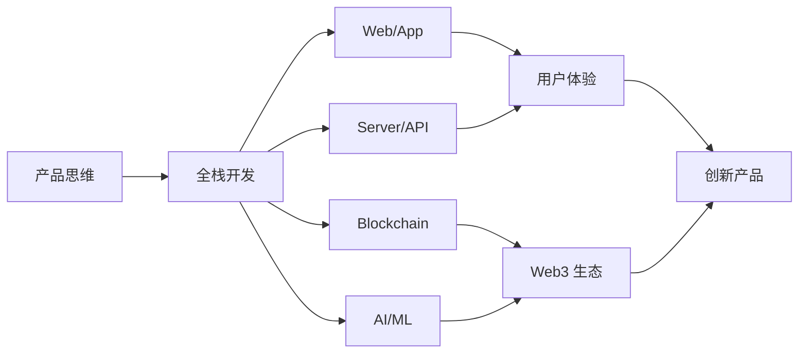

<div align="center">
  
# 👋 GM, I'm Lucas.gg

### 🔗 Web3 Builder | 💻 Full-Stack Engineer | 🚀 Product Innovator

[](https://github.com/Guanyuhao)
[](https://guanyuhao.github.io/)

</div>

---

## 🎯 关于我

```solidity
// SPDX-License-Identifier: MIT
pragma solidity ^0.8.0;

contract LucasGG {
    string public role = "Software Engineer & Web3 Builder";
    string public background = "Ex-ByteDance Frontend Engineer";
    string public location = "Beijing, China 🇨🇳";
    
    string[] public expertise = [
        "Product Design",
        "Full-Stack Development", 
        "Web & Mobile Apps",
        "Backend & Server",
        "Blockchain & Smart Contracts",
        "AI & Machine Learning"
    ];
    
    string public motto = "相信趋势，坚守纪律 | Build the Decentralized Future";
    
    mapping(string => bool) public achievements;
    
    constructor() {
        achievements["Pull Shark"] = true;
        achievements["Arctic Code Vault Contributor"] = true;
    }
}
```

## 🛠️ 技术全景

<table>
<tr>
<td width="33%" valign="top">

### 🎨 前端 & 产品
- **框架**: React, Vue, Next.js
- **移动端**: React Native, Flutter
- **UI/UX**: Figma, 用户体验设计
- **状态管理**: Redux, Zustand, Recoil

</td>
<td width="33%" valign="top">

### ⚙️ 后端 & 服务器
- **语言**: Node.js, Python, Go
- **框架**: Express, NestJS, FastAPI
- **数据库**: PostgreSQL, MongoDB, Redis
- **部署**: Docker, K8s, AWS, Vercel

</td>
<td width="33%" valign="top">

### ⛓️ Web3 & AI
- **区块链**: Ethereum, Solidity, Web3.js
- **智能合约**: Hardhat, Foundry, OpenZeppelin
- **AI/ML**: TensorFlow, PyTorch, LangChain
- **工具**: IPFS, The Graph, Ethers.js

</td>
</tr>
</table>

## 💼 职业经历

```typescript
const career = {
    current: {
        role: "Web3 Full-Stack Engineer",
        focus: ["DApps", "Smart Contracts", "AI Integration"],
        vision: "构建去中心化的未来 🌐"
    },
    previous: {
        company: "字节跳动 (ByteDance) 📱",
        position: "Frontend Engineer",
        experience: [
            "大规模前端应用架构设计",
            "性能优化与用户体验提升",
            "跨端解决方案开发",
            "团队协作与技术分享"
        ]
    }
}
```

## 🚀 核心能力

<div align="center">



</div>

### 🎯 产品 × 技术

- **产品思维**: 从0到1的产品设计与迭代，深入理解用户需求
- **全栈开发**: 前端、后端、移动端全链路开发能力
- **Web3 实践**: 智能合约开发、DApp构建、去中心化架构设计
- **AI 集成**: 将人工智能融入产品，提升用户体验
- **架构设计**: 高可用、高性能的系统架构规划与实现

## 📊 代码时光机

<div align="center">

```ascii
╔═══════════════════════════════════════════════════════════════╗
║                                                               ║
║     ██████╗ ██╗   ██╗██╗██╗     ██████╗ ██╗███╗   ██╗ ██████╗ ║
║     ██╔══██╗██║   ██║██║██║     ██╔══██╗██║████╗  ██║██╔════╝ ║
║     ██████╔╝██║   ██║██║██║     ██║  ██║██║██╔██╗ ██║██║  ███╗║
║     ██╔══██╗██║   ██║██║██║     ██║  ██║██║██║╚██╗██║██║   ██║║
║     ██████╔╝╚██████╔╝██║███████╗██████╔╝██║██║ ╚████║╚██████╔╝║
║     ╚═════╝  ╚═════╝ ╚═╝╚══════╝╚═════╝ ╚═╝╚═╝  ╚═══╝ ╚═════╝ ║
║                                                               ║
║              🌐 Web3  ×  🤖 AI  ×  ⚡ Full-Stack              ║
║                                                               ║
╚═══════════════════════════════════════════════════════════════╝
```

</div>

<div align="center">

### 🎯 技能矩阵


</div>

<br/>

<div align="center">

### 📈 GitHub 统计


</div>

<br/>

<div align="center">

### 🏆 Trophy Case


</div>

<br/>

<div align="center">

```diff
+ 🚀 持续构建 | ⚡ 不断创新 | 🌐 拥抱未来
```

</div>

## 🏆 GitHub 成就

<div align="center">


</div>

## 📝 技术分享

🔗 访问我的个人博客：**[guanyuhao.github.io](https://guanyuhao.github.io/)**

### 分享内容包括：

- 🌐 **Web3 开发**: 智能合约、DApp、去中心化架构
- 💻 **全栈技术**: 前端框架、后端服务、移动开发
- 🤖 **AI 应用**: 机器学习、大模型集成、智能化产品
- 📊 **产品思维**: 需求分析、用户体验、产品迭代
- 🏗️ **架构设计**: 系统设计、性能优化、最佳实践

## 🌟 技术理念

<div align="center">

> *"从产品视角出发，用全栈能力实现，借助 Web3 和 AI 创新"*
>
> *"Build products that matter, with technologies that empower"*

</div>

## 📫 联系我

<div align="center">

[](https://github.com/Guanyuhao)
[](https://guanyuhao.github.io/)

</div>

---

<div align="center">
  
### 💬 *"相信趋势，坚守纪律 | Building Web3 × AI Future"*


**🌐 Let's build the decentralized future together! ⭐**

</div>
